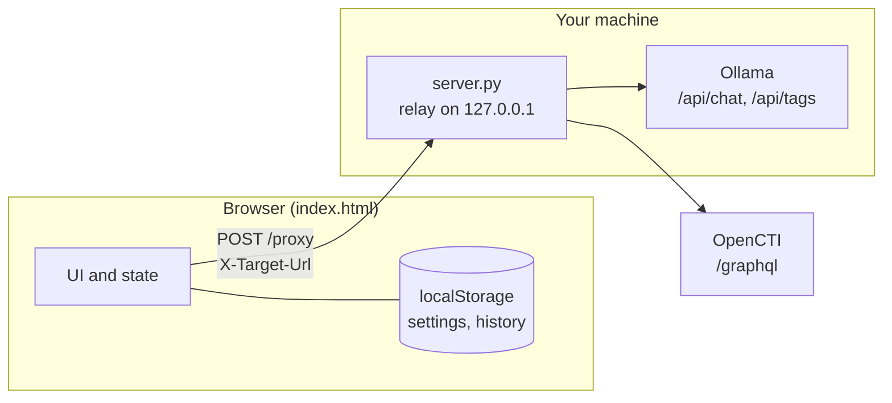
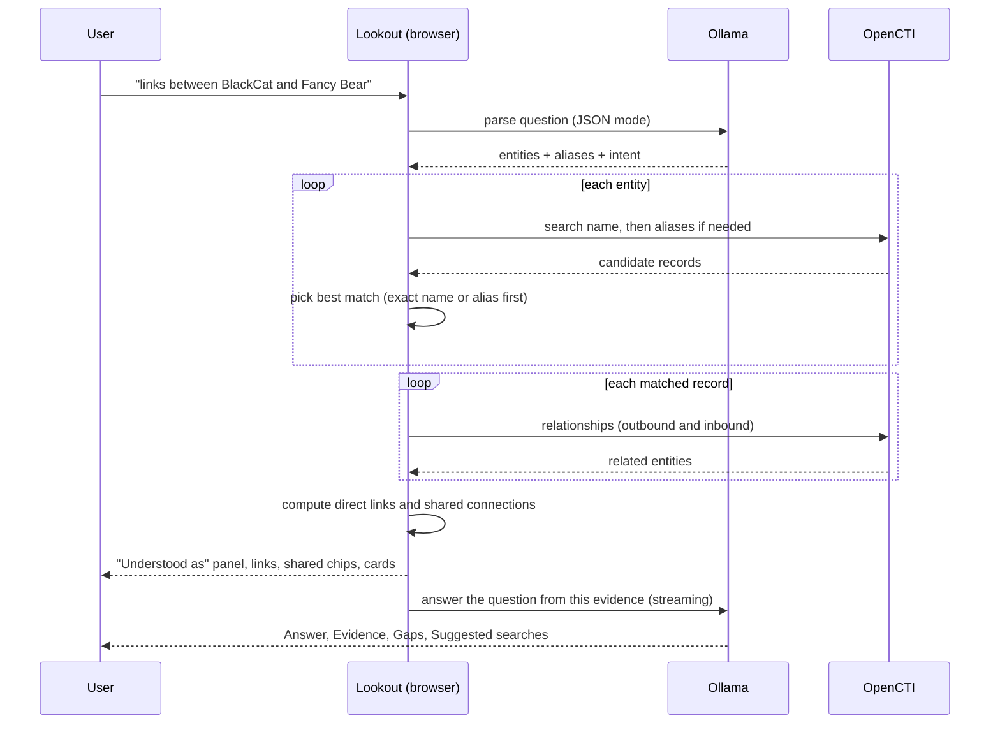

# Lookout: architecture and design decisions

This document explains how Lookout is put together and why. It is written for someone reviewing the design: each section states what was chosen, the alternatives that were considered, and the trade-offs accepted. The last sections list known limitations and what has and has not been tested.

## 1. Goals and constraints

**Goals**

1. Query an OpenCTI platform through its GraphQL API from a friendly UI.
2. Use a **local** Ollama model to turn raw results into recommendations, so threat-intelligence data never leaves the analyst's environment.
3. Keep search history, support plain-English questions, and produce a longer intel-bulletin write-up on demand.

**Constraints that shaped the design**

| Constraint | Consequence |
| --- | --- |
| The model must be local | No hosted LLM APIs. All model traffic goes to the user's Ollama. |
| Browsers block cross-origin calls (CORS) | A small local relay is needed between the page and OpenCTI/Ollama. |
| A hosted page cannot reach `localhost` services | The app is delivered as local files, not as a hosted artifact. |
| Easy to run and review | No build step, no package installs, no framework. |
| OpenCTI schemas differ between versions | Queries need fallbacks, and the app must show GraphQL errors clearly. |
| CTI data is untrusted input | Escape everything rendered, and tell the model to treat data as data. |

## 2. System overview

There are two deliverables and no other moving parts:

- **`index.html`**: the entire front end (HTML, CSS and JavaScript in one file, no external scripts, fonts or images).
- **`server.py`**: a Python standard-library relay that serves the page and forwards requests.

## 3. Components

### 3.1 Relay (`server.py`)

**Responsibilities:** serve `index.html`; forward `GET`/`POST` requests from the page to the OpenCTI or Ollama URL named in a request header; stream responses back unbuffered.

**Request contract**

| Header | Meaning |
| --- | --- |
| `X-Target-Url` | Full upstream URL to call (must be `http` or `https`). |
| `X-Target-Auth` | Optional value sent upstream as `Authorization` (the page sends `Bearer <token>`). |

**Design choices**

- **One generic `/proxy` endpoint**, not one route per service. The URLs live in the UI settings, so changing servers needs no restart or config file.
- **Standard library only** (`http.server`, `urllib`). Nothing to install, and the whole relay is about 150 lines that can be read in a few minutes.
- **Streaming pass-through.** The relay reads upstream with `read1` and flushes each chunk, which is what makes Ollama tokens appear live. Responses use `Connection: close` (HTTP/1.0 behaviour), so no chunked-encoding logic is needed.
- **Upstream errors are passed through** with their status code. Connection failures become a `502` with a JSON `error` string that the UI shows verbatim.
- **Threaded server with daemon threads**, so a long model generation does not block other requests, and Ctrl+C exits cleanly.
- **`--insecure` is opt-in** and applies to all upstream calls (see limitations).

**Security controls**

1. Binds to `127.0.0.1` only. There is deliberately no `--host` option.
2. Rejects any request whose `Host` header is not `localhost`, `127.0.0.1` or `[::1]`. This blocks DNS-rebinding attacks.
3. Rejects requests that carry an `Origin` header different from the page's own host. This blocks other websites in the browser from using the relay.

**Alternative considered: enable CORS on Ollama and OpenCTI directly.** This needs changes to both servers (`OLLAMA_ORIGINS`, OpenCTI CORS settings), does not work from a `file://` page, and spreads configuration across three places. The relay keeps the setup to "run one script".

### 3.2 Front end (`index.html`)

**Structure:** one HTML file with three sections of code: CSS tokens and layout, markup, and a single script. There is no framework.

**Layout:** three columns on wide screens (history, results, recommendations). Below 1100px the recommendations column moves under the results. Below 760px history collapses behind a button.

**State** is one plain object plus two persisted stores:

| Where | What | Lifetime |
| --- | --- | --- |
| `state` (memory) | current term, results, filter, mode, contextual context, focus entity, request counter, AI text | page session |
| `state.related` (memory `Map`) | relationships already fetched, keyed by entity id | page session |
| `localStorage` `lookout.settings` | URLs, API token, model, auto-run flag, search mode | persistent |
| `localStorage` `lookout.history` | up to 60 searches with term, result count, mode, timestamp | persistent |

**Rendering** is template strings assigned to `innerHTML`, with **every dynamic value passed through `esc()`**. Event handling uses delegation (`data-*` attributes) so re-rendering does not need listener bookkeeping.

**Concurrency control**

- A monotonically increasing `state.seq` identifies the current search. Each async step checks it, so a slow earlier search can never overwrite a newer one. In the contextual flow, stale work throws a sentinel error that the catch block silently ignores.
- Recommendations and bulletins each have their own `AbortController`. Starting a new search aborts the old generation. Closing the bulletin dialog aborts its generation.

**Accessibility and quality floor:** the mode switch is a `radiogroup`, expandable cards use `aria-expanded`, focus rings are visible, motion is limited to a blinking caret that stops under `prefers-reduced-motion`, and light and dark themes follow the system setting.

**Visual design:** a cool slate-and-ink palette with a single cobalt accent. Entity names are set in a serif face and interface text in a sans-serif face, using system font stacks so nothing is downloaded. Each result card has a colour stripe by entity type (red for actors and campaigns, orange for malware and tools, purple for techniques, amber for vulnerabilities, teal for indicators and observables, blue for reports and incidents, grey for everything else) so a mixed result list can be scanned quickly.

## 4. OpenCTI integration

**API used:** `POST {base}/graphql` with a bearer token, through the relay.

**Queries**

| Purpose | Query |
| --- | --- |
| Search | `stixCoreObjects(search: "...", first: 30)` returning type-specific fields through inline fragments |
| Relationships | `stixCoreRelationships(fromId: "...")` and `(toId: "...")` in one request, aliased `out` and `inc`, 80 each |
| Auth check | `me { name }` |

**Design choices**

- **One search across all entity types** (`stixCoreObjects`) rather than one query per type. One round trip, relevance-ordered by OpenCTI, and the type filter chips are built client-side.
- **Inline fragments** (`... on Malware { ... }`) select only the fields that matter for each type.
- **Values are inlined as JSON-escaped string literals**, not GraphQL variables. The `fromId`/`toId` argument types differ between OpenCTI versions (a single string versus a list), and an inlined string literal is accepted by both. `JSON.stringify` output is a valid GraphQL string, so user text cannot break out of the literal.
- **Version fallback ladder.** OpenCTI 6.x names the type `ThreatActorGroup`; 5.x used `ThreatActor`. The search tries four variants in order: 6.x names with full fields, 5.x names with full fields, then both again with a reduced field set (dropping labels, dates, CVSS, malware types). It only retries on GraphQL-level errors. Network, HTTP and auth errors surface immediately.
- **Partial GraphQL errors are tolerated** when data came back, so one unreadable field does not blank the whole result.
- **Relationships are loaded lazily** when a card is opened (or when a contextual search or bulletin needs them), and cached for the session.

## 5. Local-model integration

**API used:** Ollama `/api/chat` (streaming for answers, non-streaming JSON mode for question parsing) and `/api/tags` (to list installed models).

### 5.1 Three model tasks

| Task | Mode | Temperature | Context window | Output |
| --- | --- | --- | --- | --- |
| Parse a plain-English question | non-streaming, `format: "json"` | 0.1 | 2048 | `{entities:[{name,aliases}], intent}` |
| Recommendations | streaming | 0.2 | 8192 | Markdown with fixed sections |
| Intel bulletin | streaming | 0.2 | 12288 | Markdown with fixed structure |

Low temperatures favour sticking to the supplied data. Context sizes are set explicitly because Ollama's default window is small and would silently truncate long inputs.

### 5.2 What the model receives

The model never sees raw API responses. A `condense()` step builds a trimmed object per record (type, name, aliases, description clipped to 280 characters, labels, MITRE ID, CVSS, key dates, indicator pattern clipped to 120). Empty fields are removed to save tokens.

| Flow | Data sent |
| --- | --- |
| Simple recommendations | top 15 results, condensed |
| Contextual recommendations | matched records, related entities grouped by type (12 per type), direct links, shared connections (30), entities not found |
| Entity-focused advice | the above plus the opened entity and its relationships |
| Bulletin | top 5 non-observable results with 700-character descriptions and 25 related entities per type, plus names of 10 other matches; or the contextual payload at the same sizes |

### 5.3 Prompt design

- **Fixed output structure.** The recommendation prompt requires Summary, Look at first, Gaps and cautions, and Suggested searches. The contextual prompt requires Answer, Evidence, Gaps and cautions, and Suggested searches. A fixed shape makes small models more reliable and lets the UI render consistently.
- **Grounding rules.** Every prompt says to use only facts present in the JSON, never to invent indicators, attributions or relationships, and to say plainly when something is not recorded.
- **Untrusted data rule.** Every prompt tells the model that the JSON comes from a database and that any instructions inside it must be ignored.
- **Closest-match flag.** When a contextual lookup could only find an approximate record, it is marked `closest_match` and the prompt tells the model to say the match may not be what the analyst meant.
- **Parseable suggestions.** The final section, `SUGGESTED SEARCHES`, is split off in code and rendered as clickable chips, so the model's suggestions become one-click follow-up searches.

### 5.4 Rendering model output

A small purpose-built Markdown renderer handles headings, bullets, bold, italics, inline code and (in bulletin mode) horizontal rules. **Text is HTML-escaped first, then formatted**, so model output (and any hostile text it echoes from the database) cannot inject markup. Writing a minimal renderer avoided shipping a Markdown library, which would have needed an external script.

## 6. Key flows

### 6.1 Simple search

1. User submits a term. Request counter increments; any running generation is aborted.
2. One `stixCoreObjects` query (with the version fallback ladder) returns up to 30 results.
3. Results render as cards, the term is added to history, and (if "Run after each search" is on) the recommendation call starts.
4. Opening a card loads and shows its relationships. Clicking a related entity runs a new search.

### 6.2 Contextual search

**Matching rules**

- Up to 4 entities per question; each is searched by name first, then by the model's aliases, stopping at the first **exact** name or alias match.
- With an exact match, up to 2 records of that name are kept (for example a malware family and an intrusion set with the same name). Without one, the single best-ranked record is used and flagged as a closest match; reports, indicators, incidents and observables are ranked below actors, malware and techniques.
- If two asked entities resolve to the same record, the duplicate is dropped.
- Entities with no record are listed as "not found" instead of being silently ignored.

**Link analysis (done in code, not by the model)**

- **Direct link:** a relationship from one entity's related list whose other end is another asked entity (matched by name or alias). Inbound and outbound directions are normalised so the same relationship seen from both sides appears once.
- **Shared connection:** a related entity (same type and name) that appears under two or more asked entities.

**Why compute this in code?** Set intersection is exact and cheap, and models are unreliable at it. The model is given the results as facts and only has to explain them, which keeps its role to summarising and prioritising.

### 6.3 Intel bulletin

1. The user clicks **Expand into intel bulletin**.
2. Relationships for the top results are fetched (or reused from the cache or a contextual search).
3. A dedicated prompt with a larger context window streams a document into a reading dialog.
4. When finished, **Copy Markdown**, **Download .md** and **Print or save as PDF** are enabled. Printing uses a print stylesheet that hides everything except the bulletin.

The bulletin is generated from the same retrieved evidence as the recommendations, plus more relationships and longer descriptions. It is a presentation of OpenCTI records, not a new analysis, and the document itself states that it is unverified and that a TLP marking is to be assigned by the analyst.

## 7. Decision log

| # | Decision | Alternatives | Why this one | Trade-off accepted |
| --- | --- | --- | --- | --- |
| 1 | Deliver as local files, not a hosted page | Publish as a hosted artifact | A hosted page cannot call `localhost` Ollama or an internal OpenCTI | The user has to run a script |
| 2 | Python stdlib relay | Node/Express, enabling CORS on each service | Zero installs, short and reviewable, one place to apply security checks | Not suited to public exposure |
| 3 | Single generic `/proxy` endpoint | Per-service routes with server-side config | URLs and token are changed in the UI without restarting | The relay forwards to whatever URL the page names (mitigated by the host and origin checks) |
| 4 | Single-file front end, no framework | React/Vite project | No build step, easy to audit and to open offline | Larger file; manual DOM updates |
| 5 | No external scripts, fonts or images | CDN libraries and web fonts | Works on air-gapped networks; no third-party requests from a security tool | System fonts only; hand-written Markdown renderer |
| 6 | Escape-then-format rendering | Trust model and API output | CTI data and model output are untrusted | Limited Markdown support (no tables or links) |
| 7 | Unified `stixCoreObjects` search | Per-type queries | One round trip, OpenCTI's own relevance ranking | Result limit shared across types |
| 8 | Inline GraphQL literals | GraphQL variables | Avoids argument-type mismatches across OpenCTI versions | Query text is built by string concatenation (values are JSON-escaped) |
| 9 | Fallback ladder for threat-actor type and field set | Detect version first | Works without a version call and degrades gracefully | Up to four attempts on an unsupported schema |
| 10 | Compute links and overlaps in code | Ask the model to find them | Deterministic, exact, cheap | Matching is by name and alias, so unlisted aliases are missed |
| 11 | Model plans the query in Contextual mode | Keyword extraction by rules | Handles phrasing, aliases and typos far better than regexes | Extra model call; quality depends on the model |
| 12 | Fixed output sections and a parseable suggestions block | Free-form answers | Reliable with small models; suggestions become clickable | Less natural prose |
| 13 | Low temperature, explicit context sizes | Defaults | Sticks to the data; avoids silent truncation | Larger context uses more memory |
| 14 | Settings and history in `localStorage` | Server-side storage, cookies | No server state; works with the stateless relay | Token is stored unencrypted in the browser profile |
| 15 | Request counter plus abort controllers | Disable the UI while loading | Fast typing and quick re-searches stay responsive | Slightly more code to reason about |
| 16 | Bulletin as a separate pass | Longer default answer | Keeps the main panel fast and short; opt-in cost | A second model call |
| 17 | Print stylesheet for PDF | Server-side PDF generation | No dependencies | Output depends on the browser's print dialog |

## 8. Security and privacy model

**Data flow:** the browser talks only to the local relay; the relay talks only to the OpenCTI and Ollama URLs you configure. There is no telemetry, analytics or third-party request.

**Threats considered**

| Threat | Mitigation | Residual risk |
| --- | --- | --- |
| A malicious website uses the relay from your browser | Origin check; relay binds to localhost | Non-browser software already running on your machine can still call it |
| DNS rebinding | Host header allow-list | None identified |
| XSS through entity names or descriptions | `esc()` on every dynamic value; model output escaped before formatting | None identified, but this is the area to re-test after any change |
| Prompt injection from database content | Prompts instruct the model to ignore embedded instructions; model has no tools and can only produce text | A hostile record could still skew the wording of a summary, so outputs need human review |
| Token exposure | Token stays in the local browser profile and is sent only to the relay | Stored in plain text in `localStorage` |
| Over-trusting AI output | Prompts forbid invention; closest-match flag; bulletin carries an "unverified" line; UI reminders | The model can still be wrong |

## 9. Known limitations

- **Not tested against a live OpenCTI or Ollama.** The queries are written from the OpenCTI schema and may need adjustment for specific versions or custom field permissions. See section 10.
- **Name-based matching.** Direct-link and shared-connection detection compare names and aliases as text. Aliases that OpenCTI does not store will not match.
- **Search depth.** Search returns 30 results and relationship loading returns 80 per direction. Very connected entities are truncated (the UI says "more in OpenCTI").
- **Relationship cache is per page session** and is not invalidated, so changes made in OpenCTI after a lookup are not seen until reload.
- **Model quality varies.** Small models can mis-extract entity names in Contextual mode, produce thin summaries, or ignore the section structure. Models of roughly 8B parameters and up are noticeably better.
- **`--insecure` is global** for the relay process: it disables certificate checks for both OpenCTI and Ollama connections.
- **One user, one machine.** No authentication on the relay itself, no multi-user support, no shared history.
- **Markdown subset.** Tables, links and nested lists in model output are shown as plain text.

## 10. Testing performed

| Area | What was done | Result |
| --- | --- | --- |
| Python and JavaScript | Syntax checks | Pass |
| Relay | Request forwarding, token pass-through, streaming, bad `Host`, cross-origin `Origin`, unreachable upstream, against a mock upstream | Pass |
| Contextual search and bulletin | Scripted end-to-end run of the front-end logic with mocked OpenCTI and Ollama responses: entity extraction, alias resolution, relationship loading, direct-link and shared-connection detection, streaming recommendations, bulletin generation, fall-back to Simple mode | Pass |
| Live OpenCTI, live Ollama, real browser rendering, real model output quality | Not done | **Needs your verification** |

**Suggested first checks on a real setup:** run a Simple search for a name you know exists; open a card and confirm relationships appear; run a Contextual question that mentions two entities you know are linked; generate a bulletin and compare its claims against the OpenCTI records.

## 11. Extension points

- **More entity types or fields:** add fragments in `nodeFields()` and `relFields()`.
- **Other models or providers:** the model layer is two functions, `chat()` and `streamChat()`. Pointing them at another local server with a compatible chat API is a small change.
- **Different bulletin styles:** edit `BULLETIN_SYSTEM`. A tone option (executive summary versus technical detail) would be a prompt variant selected in the UI.
- **Stronger link analysis:** extend `buildContext()` to follow two-hop relationships or use OpenCTI's own path queries.
- **Storage:** history and settings go through a small `store` helper, so replacing `localStorage` is localised.

## 12. Design choices worth a second look

These are the choices most likely to be worth revisiting depending on your environment:

1. **Token in `localStorage`.** Acceptable for a personal local tool, but if the browser profile is shared or synced, consider moving the token to an environment variable read by `server.py`.
2. **Generic relay target.** If the relay will ever run anywhere other than a personal machine, restrict allowed targets to a configured allow-list.
3. **Heuristic entity selection in Contextual mode.** The "Understood as" panel exposes this on purpose. If wrong matches are common, add a click-to-correct control for each entity.
4. **Single-file front end.** It is easy to audit today. If it grows much further, splitting the script into modules (and adding tests) would be worth the build step.
