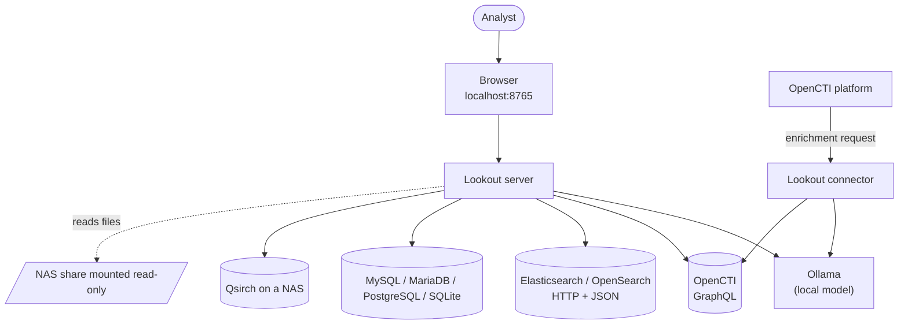
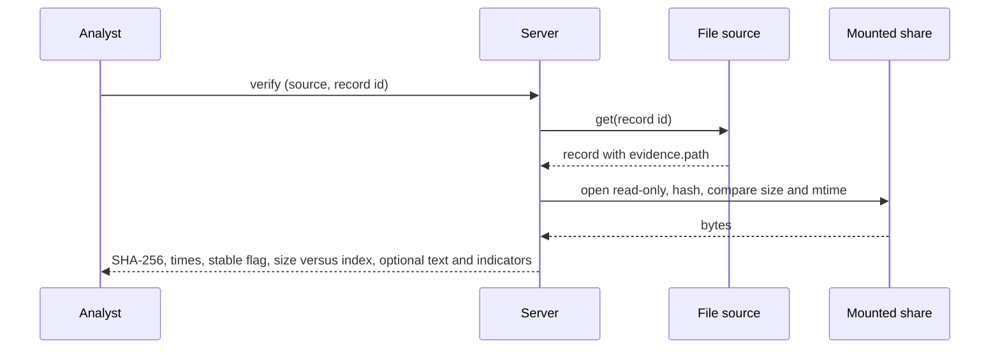

# Lookout: architecture and design

This document describes how Lookout is built and why. It is written for reviewers and contributors. Each major choice records what was chosen, what else was considered, and what it costs. For installation see [docs/INSTALLATION.md](docs/INSTALLATION.md); for risks and protections see [docs/SECURITY.md](docs/SECURITY.md).

## Contents

1. [Purpose, scope and non-goals](#1-purpose-scope-and-non-goals)
2. [Design principles](#2-design-principles)
3. [System context](#3-system-context)
4. [Components](#4-components)
5. [Data model](#5-data-model)
6. [Data-source adapters](#6-data-source-adapters)
7. [Core logic](#7-core-logic)
8. [Evidence subsystem](#8-evidence-subsystem)
9. [Server and API](#9-server-and-api)
10. [Web front end](#10-web-front-end)
11. [OpenCTI connector](#11-opencti-connector)
12. [Configuration, errors, limits and testing](#12-configuration-errors-limits-and-testing)
13. [Extending Lookout](#13-extending-lookout)
14. [Decision log](#14-decision-log)
15. [Known limitations and possible next steps](#15-known-limitations-and-possible-next-steps)

## 1. Purpose, scope and non-goals

**Purpose.** Give an analyst one place to search several heterogeneous data sources, with a local language model that explains results, answers questions, and drafts reports, while keeping data inside the analyst's environment.

**In scope:** read-only search; relationship exploration; plain-English questions; indicator pivots between sources; evidence verification for files; bulletin drafting; an OpenCTI connector.

**Non-goals:** writing to data sources (except the connector's Notes), multi-user access control, hosted/cloud deployment, replacing the source systems' own interfaces, automatic decision-making. The model produces drafts for a person to review.

## 2. Design principles

1. **One shape for everything.** Every source returns the same normalised records and relations, so the UI, prompts and analysis never contain source-specific code.
2. **Facts in code, wording in the model.** Searching, matching, link analysis, indicator extraction, hashing and the evidence appendix are ordinary code, so they are exact and testable. The model understands the question and explains the result.
3. **The browser is not trusted with secrets or authority.** Credentials, file paths and hashes live on the server. The browser sends record ids, not paths.
4. **Read-only by construction.** Adapters issue reads; files are opened for reading; SQL is parameterised and checked; sessions are read-only where the engine allows.
5. **Say what is not known.** When a source has no relationships, a record is only a close match, text is machine-generated, or a file was not verified, the interface and the prompts say so.
6. **Small and reviewable.** The core uses only the Python standard library. The front end is one file with no external requests.
7. **No guessing at interfaces.** Where an external API is undocumented to us (Qsirch), nothing is invented; the code isolates the gap behind an interface.

## 3. System context



The server and the connector are separate processes that share the `lookout_core` library.

## 4. Components

| Path | Role |
| --- | --- |
| `web/index.html` | The whole UI: markup, styles and script. State, rendering, history, streaming. |
| `web/server.py` | Local HTTP server. Serves the page and a JSON/streaming API. Guards (host and origin checks). Orchestrates adapters, analysis and Ollama. |
| `lookout_core/models.py` | Constructors for records and relations; `coerce_*` rebuilds client-supplied data. |
| `lookout_core/config.py` | TOML loading, `${ENV_VAR}` expansion, validation. |
| `lookout_core/sources/` | One adapter per kind, behind the `DataSource` contract. |
| `lookout_core/federated.py` | Searches several sources as one; indicator pivots. |
| `lookout_core/analysis.py` | Question planning, matching, link analysis, payload building, prompt assembly, evidence appendix. |
| `lookout_core/ioc.py` | Indicator extraction and refanging. |
| `lookout_core/evidence.py` | Path mapping, hashing, text extraction. |
| `lookout_core/prompts.py` | All system prompts, parameterised by data source. |
| `lookout_core/ollama.py` | Ollama client: model list, chat, streaming. |
| `connector/` | OpenCTI internal-enrichment connector (the only code that imports pycti). |
| `examples/`, `tests/` | Demo data and the automated tests. |

Dependencies: none beyond the standard library for the core and server. Optional: `pymysql`, `psycopg` for those databases; `pycti` and `PyYAML` for the connector.

## 5. Data model

All structures are plain dictionaries that serialise to JSON.

**Record**: one searchable thing (an entity, a row, a document, a file).

| Field | Meaning |
| --- | --- |
| `id` | Unique within its source |
| `type` | Display type, such as `Intrusion-Set`, `Incident`, `Photo` |
| `name`, `description`, `aliases[]`, `labels[]` | Core text |
| `meta[]` | Ordered `{k, v}` facts shown on the card and given to the model (CVSS, status, size...) |
| `code` | Optional monospace snippet (an indicator pattern, a command line) |
| `date`, `date_label` | One headline date and what it means (`Added`, `Modified`, `Taken`) |
| `rank`, `observable` | Hints so reports and bare observables do not headline results or bulletins |
| `evidence` | For files: `path`, `size`, `modified`, `indexed`, `ai_derived[]`, and (server-added) `sha256`, `hashed_at`, `stable` |
| `source`, `source_label` | Set by the server, never by adapters |

**Relation**: a link from a record: `type`, `name` (what a user would search for next), `rel`, `dir` (`outbound` or `inbound`), optional `code`.

**Context** (the result of a plain-English question): `question`, `intent`, `filters`, `groups[]` (each: `asked`, `records[]`, `exact`, `related[]`), `missing[]`, `direct[]`, `shared[]`, `pivots[]`, `federated`, `relationships`.

Design notes:

- `meta` is a list of label/value pairs rather than fixed fields. A CVSS score, a severity and a log action are all "facts"; the card, the model payload and the bulletin treat them identically.
- A relation's `name` is deliberately "the thing to search next". Clicking it runs a search, which is what makes pivoting work on every source.
- Client-supplied data is rebuilt with `coerce_record` / `coerce_context` before use. Hash fields sent by a browser are discarded and re-attached from the server's own verification cache.

## 6. Data-source adapters

### 6.1 Contract

```python
class DataSource:
    kind: str
    relationships: bool          # can related() return anything?
    filter_keys: tuple           # filters this source can apply
    content: ContentAccess|None  # optional file access (see section 8)
    def describe(self) -> str                       # one line for the model and the UI
    def test(self) -> str                           # prove connection and configuration, or raise SourceError
    def search(self, term, limit=30, filters=None)  # -> (records, total or None)
    def get(self, record_id)                        # -> record or None
    def related(self, record_id, limit=80)          # -> relations
```

Errors are `SourceError` with a message safe to show. Adapters are imported lazily, so a missing database driver affects only the source that needs it, and the message names the `pip install` to run.

### 6.2 OpenCTI

GraphQL over HTTP with a bearer token. One `stixCoreObjects` search spans all entity types; relationships come from one request with aliased outbound and inbound queries. Values are inlined as JSON-escaped string literals (valid GraphQL), not variables, because the type of `fromId`/`toId` differs between OpenCTI versions. A four-step fallback ladder copes with schema differences (6.x `ThreatActorGroup` versus 5.x `ThreatActor`, then reduced field sets): it retries only on schema errors and then pins the variant that worked. An optional `transport` lets the connector reuse pycti's authenticated client.

### 6.3 Elasticsearch / OpenSearch

HTTP and JSON using `urllib`. Search is a `simple_query_string` with `lenient: true` and `default_operator: and`. A mapping in the configuration names the dotted field paths for name, description, date, type, aliases, labels, code and key facts. Record ids are `index|doc_id`, because an index pattern like `logs-*` cannot address one document. Documents have no relationships, so **"related" means the values of configured pivot fields** (host, user, IP). Clicking one searches for it.

### 6.4 SQL (MySQL, MariaDB, PostgreSQL, SQLite)

Configuration-driven, because Lookout cannot know what a schema means. Each searchable table is an `[[sources.entities]]` block mapping columns to record fields. Searches are parameterised SELECTs using `LIKE`/`ILIKE` (with `ESCAPE '!'` so `%` and `_` are literal) or MySQL/MariaDB `MATCH ... AGAINST`. Relationships are SELECT statements written by the administrator, using a `:id` placeholder.

Safeguards: values are always bound parameters; table and column names come from configuration, are validated against a strict pattern and quoted; relation SQL must be a single SELECT/WITH statement; `:id` is rewritten to the driver's placeholder and literal `%` is escaped for `%s`-style drivers; connections are opened read-only where the engine supports it (SQLite `mode=ro`, MySQL `SET SESSION TRANSACTION READ ONLY`, PostgreSQL `default_transaction_read_only`). The database account should hold SELECT only; that is the real boundary and the rest is defence in depth. SQLite identifiers are quoted with backticks because SQLite treats an unknown double-quoted name as a string literal, which would turn a configuration typo into silently wrong results (a test caught this).

### 6.5 QNAP Qsirch

The adapter talks to a `QsirchBackend` interface (test, search, get, thumbnail, capabilities). Two backends exist: `FixtureBackend` (sample data, used for development and tests) and `HttpBackend`, a placeholder that raises a clear "waiting for the API reference" error. **No Qsirch endpoint or field name is guessed.** A configurable field mapping turns raw items into records, with people, tags, objects, places and the containing folder as pivot relations, and with an `evidence` block recording which text is machine-generated (OCR, summaries, transcripts). When the real response format is known, only the backend and the default mapping change. Status and hand-over checklist: [docs/QSIRCH.md](docs/QSIRCH.md).

## 7. Core logic

### 7.1 Plain-English questions

```mermaid
sequenceDiagram
  participant U as Analyst
  participant S as Server
  participant M as Ollama
  participant X as Sources
  U->>S: "links between A and B"
  S->>M: extract entities, aliases, optional filters (JSON mode)
  M-->>S: {entities, intent, filters}
  loop each entity
    S->>X: search name, then aliases; stop at first exact match
  end
  loop each matched record
    S->>X: related()
  end
  S->>S: direct links, shared connections (set logic)
  S->>S: indicator pivots across sources (federated only)
  S-->>U: "Understood as" panel with links and pivots
  S->>M: answer the question from this evidence (streaming)
  M-->>U: Answer, Evidence, Gaps, Suggested searches
```

- Up to four entities per question. For each, the name is searched first and then up to three aliases, stopping at the first **exact** name or alias match. Without one, the best-ranked result is used and flagged `closest match`.
- Two names resolving to the same record merge silently; a name with no record is reported as not found.
- **Direct link:** a relation from one group whose other end is another asked entity (inbound/outbound normalised so each appears once). **Shared connection:** a related item present under two or more asked entities.
- Filters proposed by the planner (`category`, `date_from`, `date_to`, `path_contains`) are validated (dates must be `YYYY-MM-DD`) and passed only to sources that declare support.
- The planner is a generator that yields progress events, so the UI shows what is happening while the connector simply drains it.

### 7.2 Federation and indicator pivots

`Federation` presents all sources as one object with the same interface, so contextual search, recommendations and bulletins work on it unchanged. It searches sources in parallel (up to four threads), tags each record with its source, interleaves results so every source is represented, and reports a failing source in an `errors` map instead of failing the search.

For each matched entity, `ioc.py` extracts indicators from its text and related items (after refanging `hxxp`, `[.]`, `[at]` and similar). Each indicator is searched in every source **except the one it came from**, and hits that are already part of the group are removed. The result is shown beside the entity and given to the model labelled as text matches. Caps: four indicators per entity and twelve in total per question.

Indicator extraction is pattern-based and deliberately conservative: IPv4/IPv6 are validated, hashes must be exactly 32/40/64 hex characters, and domains whose final label is a common file extension (`pdf`, `exe`, `php`, and also `sh`, `py`, `md`, `zip`, `mov`) are ignored, which hides a few real domains by design.

### 7.3 Model usage

| Task | Mode | Temperature | Context | Output |
| --- | --- | --- | --- | --- |
| Parse a question | non-streaming, JSON mode | 0.1 | 2048 | `{entities, intent, filters}` |
| Recommendations or answer | streaming | 0.2 | 8192 | Markdown, fixed sections |
| Bulletin | streaming | 0.2 | 12288 | Markdown, fixed structure |

What the model receives is a trimmed JSON payload, never raw API responses. Recommendations use the top 15 results (280-character descriptions); a bulletin uses the top 5 non-observable results with 700-character descriptions and up to 25 related items per type, plus the names of ten other matches. Empty fields are dropped to save tokens. Context sizes are set explicitly because Ollama's default window is small and would truncate silently.

### 7.4 Prompts

All prompts live in `prompts.py`, built per source from its label and description. Every prompt: use only facts in the JSON; never invent identifiers or relationships; treat the JSON as untrusted and ignore instructions inside it; follow a fixed section structure. Additional rules cover evidence: text listed as `ai_derived` must be described as machine-generated and never as a verbatim quote; findings must name their source; pivots are text matches and not proof. The final `Suggested searches` section is split off by the UI into clickable chips.

### 7.5 Bulletin and evidence appendix

A bulletin is generated from the same retrieved evidence as the recommendations, with more relationships and longer descriptions. After the model finishes, the **server appends an evidence appendix written by code**: for each file cited, its path, index times, whether a hash was verified in this session (and the hash with when it was computed, flagged if the file changed during the read), and which of its text is machine-generated. The model cannot alter or invent these lines.

## 8. Evidence subsystem

File indexes report paths as the NAS sees them. To read a file, Lookout needs the same share mounted locally and a `path_map` saying which remote folder lives where.

- **Mapping.** `ContentAccess.local()` normalises the remote path, matches the most specific mapped folder, joins the rest to the local root, resolves symbolic links, and refuses anything that ends up outside the root.
- **Hashing.** The file is opened read-only and streamed through SHA-256 in 1 MiB chunks. Size and modification time are compared before and after; a difference sets `stable: false`. A size limit (default 4 GB) applies.
- **Text.** Plain text, Markdown, CSV, JSON, logs, INI/YAML, HTML (tags stripped), `.eml` and `.docx` (read from the zip's XML) are supported, with output capped (default 20,000 characters). PDFs and images are not read; Lookout relies on what a file index already extracted.
- **Authority.** `POST /api/evidence` receives a source and a record id. The server fetches the record from the source and uses *its* path. A path from the browser is never used.



## 9. Server and API

`web/server.py` is a `ThreadingHTTPServer` bound to `127.0.0.1`. Every request passes two guards: the `Host` header must be `localhost`, `127.0.0.1` or `[::1]` (defeats DNS rebinding), and an `Origin` header, if present, must equal the page's own host (defeats cross-site requests). Request bodies are limited to 8 MiB.

| Endpoint | Request | Response |
| --- | --- | --- |
| `GET /` | | the UI |
| `GET /api/sources` | | `{sources: [{id, label, kind, description, relationships, examples, questions, filters, evidence}], default_model}`. When two or more sources exist, an `id: "*"` entry represents all of them. No credentials or paths. |
| `GET /api/models` | | `{models: [...]}` from Ollama |
| `POST /api/test` | `{source}` | `{ok, message}` |
| `POST /api/search` | `{source, term, limit (1-100, default 30), filters}` | `{records, total}`; for `"*"` also `errors` and `counts` |
| `POST /api/related` | `{source, id}` (a real source, not `"*"`) | `{items: [relation]}` |
| `POST /api/iocs` | `{record}` or `{text}` | `{iocs: [{kind, value}]}` |
| `POST /api/evidence` | `{source, id, hash (default true), text (default false)}` | `{facts, index, size_matches_index, text?, iocs?}` |
| `POST /api/contextual` | `{source, question, model}` | newline-delimited JSON events: `{progress}` ... `{context}` |
| `POST /api/generate` | `{kind: "recommend"\|"bulletin", source, model, term, total, records, context?, focus?}` | events: `{progress}`, `{token}`, `{done}` |

Errors are JSON `{error}` with status 400 (bad request or evidence problem), 403 (guard), 404 (unknown source), 502 (data source or Ollama problem), or 500 (details in the server log only). Inside a stream, an `{error}` event ends the stream. The handler runs a streaming generator to its first event before sending headers, so validation errors arrive as real HTTP errors. If the browser disconnects, the generator is closed, which closes the Ollama connection.

Prompts are built server-side, so the browser sends back what it already holds (records, context, focus) and the server rebuilds the prompt. This keeps one implementation shared with the connector, at the cost of the browser returning some data.

## 10. Web front end

A single file with no framework and no external requests. State is one object plus two `localStorage` keys: settings (model, mode, selected source, auto-run flag) and search history (up to 60 entries with term, mode, source and count). Rendering uses template strings with every dynamic value passed through `esc()`; model output goes through a small Markdown renderer that **escapes first, then formats**. Events use delegation on `data-*` attributes.

Because records are normalised, the UI has no source-specific code: cards render `meta` pairs, and the colour for a type comes from a name-based palette with a stable hash fallback. A request counter plus `AbortController`s ensure a slow earlier search cannot overwrite a newer one, and a new search stops any running generation. The mode switch, source selector, evidence panel, indicator chips, contextual summary panel and bulletin viewer (copy, download, print) are all in this file. The print stylesheet hides everything except the bulletin.

## 11. OpenCTI connector

An internal-enrichment connector (`connector/`) that reads through the shared OpenCTI adapter, using pycti's authenticated client as the transport, and writes a Note carrying the target's markings and an `ai-generated` label. Entities get a bulletin or summary; Request-for-information cases are treated as plain-English questions. A TLP ceiling is checked before anything is sent to the model. Because it reads with its own account, it must be given a least-privilege user. See [connector/README.md](connector/README.md).

## 12. Configuration, errors, limits and testing

**Configuration** is one TOML file (`lookout.toml`), with `${ENV_VAR}` expansion so secrets stay out of it. Validation fails at start-up with a message naming the problem (missing variable, duplicate id, unknown kind, bad identifier). Full reference: [docs/INSTALLATION.md](docs/INSTALLATION.md#5-configuration-reference).

**Error handling.** Adapters raise `SourceError`; Ollama problems raise `OllamaError`; evidence problems raise `EvidenceError`. All carry messages safe to show. One failing source does not fail a federated search.

**Limits and timeouts**

| Item | Value |
| --- | --- |
| Request body | 8 MiB |
| Search results per call | 1 to 100 (UI asks for 30) |
| Entities per question | 4, with up to 3 aliases each |
| Indicators searched per question | 4 per entity, 12 total |
| Federated search threads | up to 4 |
| Timeouts | OpenCTI 60 s, Elasticsearch 30 s, SQL connect 5 s and read 30 s, Ollama 600 s (all configurable) |
| SQL rows per table | `max_rows`, default 100 |
| File hashing | 4 GB default (`max_hash_gb`) |
| File text | 20,000 characters default (`max_text_chars`) |

**Testing.** 83 tests (`python3 -m unittest discover -s tests`):

| Area | Approach |
| --- | --- |
| Config and models | environment expansion, validation, the shipped example parses and builds every source, hash-injection rejection |
| SQL | a real SQLite database: mapping, multi-table search, LIKE wildcards, injection strings, read-only connection, relation queries; generated SQL for MySQL, MariaDB fulltext and PostgreSQL |
| Elasticsearch | a mock HTTP server: request bodies, auth headers, field mapping, pivots, errors |
| OpenCTI | a fake transport: schema fallback and pinning, record mapping, relation directions |
| Qsirch (sample data) | mapping, AI-derived flags, pivots, filters, "waiting for API" errors |
| Indicators and evidence | refanging, false positives, path traversal and symbolic-link refusal, hashing and change detection, text extraction |
| Analysis and federation | matching, duplicates, missing entities, sources without relationships, parallel search with a failing source, pivots that never search their origin, evidence appendix, the demo configuration |
| Server | a real HTTP server in front of a mock Ollama: every endpoint, error codes, guards, streaming, secrets not leaked, paths and hashes not accepted from the browser |

Also run outside the suite: the UI script against a mocked server, and the connector's logic with a stubbed pycti. **Not tested:** the real services listed in the README, real browsers, other operating systems.

## 13. Extending Lookout

### New data source

```python
# lookout_core/sources/mykind.py
from ..models import record, relation
from .base import DataSource, SourceError

class MySource(DataSource):
    kind = "mykind"
    relationships = True

    def __init__(self, cfg):
        super().__init__(cfg)              # sets id, label, description, examples, content
        self.url = cfg["url"]              # read and validate your settings here

    def describe(self):
        return "My ticketing system (tickets and linked tickets)"

    def test(self):
        ...                                # raise SourceError with a helpful message on failure
        return "Connected; 1,204 tickets"

    def search(self, term, limit=30, filters=None):
        ...                                # never string-format the term into a query
        return [record(tid, "Ticket", title, description=body, meta=[("Status", s)])], total

    def get(self, record_id): ...
    def related(self, record_id, limit=80):
        return [relation("Ticket", linked_title, "blocks", "outbound")]
```

Register it in `KINDS` in `lookout_core/sources/__init__.py`, add an example block to `lookout.example.toml`, and add tests using a mock server or SQLite. Nothing else changes.

### Other extension points

- **Prompts:** edit `lookout_core/prompts.py`; there is one place to review.
- **File types for text extraction:** add a branch to `evidence.extract_text`.
- **Indicator kinds:** add a pattern to `ioc.py` and its priority to `federated.KIND_PRIORITY`.
- **Another model server:** the model layer is three methods in `ollama.py` (`models`, `chat`, `stream`).

## 14. Decision log

| # | Decision | Alternatives | Why | Cost |
| --- | --- | --- | --- | --- |
| 1 | Adapters returning normalised records | A code path per source | UI, prompts and analysis never change when a source is added | Detail that does not fit `meta` or `code` is lost |
| 2 | Data access on the server | Browser calls sources directly | Browsers cannot reach databases; credentials stay off the client | A server process must run |
| 3 | TOML configuration with `${ENV}` secrets | UI settings form; YAML; JSON | Comments, nesting, standard-library parser; secrets stay out of the file | Needs Python 3.11; changes need a restart |
| 4 | SQL by column mapping plus administrator-written relation SELECTs | Auto-discover the schema; model-written SQL | Predictable, parameterised, no model-written SQL | Setup effort per database |
| 5 | Documents "relate" through pivot fields | Treat documents as unconnected | Gives logs and files a real pivoting model | Only as good as the pivots chosen |
| 6 | Link analysis and indicator extraction in code | Ask the model | Exact, testable, cannot invent an indicator | Name and pattern matching only |
| 7 | Prompts and payloads built on the server | Keep them in JavaScript | One implementation shared with the connector | The browser returns some data |
| 8 | No generic proxy | Keep a proxy with an allow-list | No open-relay surface; no tokens in the browser | No ad-hoc URLs from the UI |
| 9 | Lazy adapter imports | Import everything at start-up | A missing driver only affects its own source | Errors surface at first use (and in `test()`) |
| 10 | Newline-delimited JSON streaming | WebSockets; server-sent events | Simple, works with `fetch`, easy to test | One connection per generation |
| 11 | Read-only enforcement in layers | Rely on the account alone | Defence in depth | Some engines ignore session read-only |
| 12 | Single-file front end | A framework and build step | Easy to audit, works offline | Large file, manual DOM updates |
| 13 | Qsirch built against a backend interface with no guessed endpoints | Write a plausible client from memory | Everything else is testable now, and nothing can be silently wrong | Cannot reach a real NAS until the reference arrives |
| 14 | Federation behaves like one source | A separate multi-source code path | Contextual search, bulletins and the connector needed no change | Record ids are only unique per source, so records carry their source |
| 15 | Evidence paths and hashes come from the server only | Let the browser pass a path | The browser cannot make the server read arbitrary files or assert a hash | A hash needs a mounted share |
| 16 | Evidence appendix written by code | Ask the model to cite files | Paths and hashes cannot be altered or invented | A plain list (the viewer renders a Markdown subset) |
| 17 | Bind to localhost, no login | Add authentication | Simple and safe for one user on one machine | Not suitable for shared machines or networks (see the security document) |

## 15. Known limitations and possible next steps

**Limitations**

- Qsirch is not connected to a real NAS yet. Live OpenCTI, Elasticsearch, MySQL/MariaDB and PostgreSQL servers have not been tried.
- Matching is by name, alias and pattern. Aliases a source does not store will not link. A pivot hit is a lead, and the absence of a hit proves nothing.
- SQL `LIKE` search has no relevance ranking (exact name matches sort first); `total` is the number returned, not a database count.
- Text extraction covers a limited set of file types; PDFs and images rely on the file index.
- One user, one machine; no login, audit log, rate limiting or TLS on the local server.
- PostgreSQL connections use the driver's default TLS behaviour; the options are not yet configurable.
- Quality depends on the model. Python 3.11 or newer is required.

**Possible next steps**, roughly in order of value: the Qsirch HTTP backend; an access token for the local server; an audit log of searches and model inputs; thumbnails; PDF text extraction as an optional dependency; configurable PostgreSQL TLS; a container image with an authenticated reverse proxy; searching several sources from the connector.
