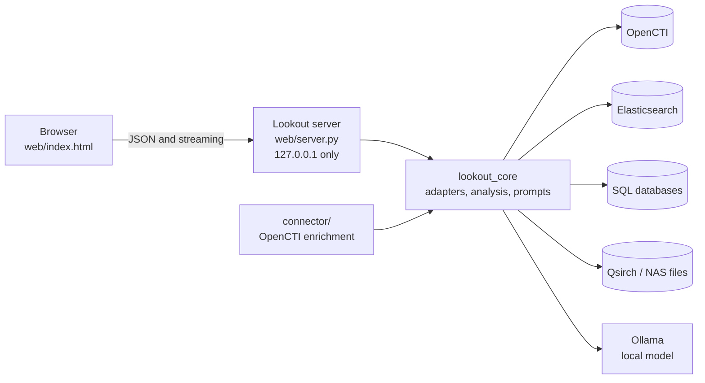

# Lookout

Search your own data sources from one web page, and let a **local [Ollama](https://ollama.com) model** suggest what to read first, answer plain-English questions, and draft intel bulletins. Nothing is sent to a cloud service: data goes only to the sources you configure and to your own Ollama.

Lookout was built for security and intelligence work. It can search a threat-intelligence platform, log stores, incident databases and file archives together, and it can check indicators found in one place against all the others. It is equally usable for any searchable data you can describe in a configuration file.

> **Status: early version.** The code is covered by 83 automated tests that use SQLite, mock servers and sample data. It has **not** been run against live OpenCTI, Elasticsearch, MySQL/MariaDB, PostgreSQL or QNAP Qsirch systems, or judged on real model output. Treat first use as a trial, and check results against sources you already know. See [Project status](#project-status).

## What it does

- **Searches several kinds of data source** through adapters, one at a time or all together.
- **Two search modes.** *Simple* matches your text. *Contextual* takes a question such as "how are these two incidents linked?"; the model works out what you mean, Lookout looks each thing up, and links between them are computed in code.
- **Shows results as cards** with the key facts, dates, labels and, for files, an evidence panel. Open a card to see related items and click one to search for it.
- **Recommends next steps** from the results: what to look at first, what is missing, and one-click follow-up searches.
- **Pivots on indicators.** IP addresses, domains, URLs, e-mail addresses, hashes, CVE and MITRE IDs are found by pattern matching (including defanged forms like `hxxp` and `[.]`) and searched for in the other sources. Matches are shown as leads, not proof.
- **Handles files as evidence.** For file indexes it shows path, size and times, labels text produced by OCR, image description or transcription as machine-generated, and can compute a SHA-256 of the file through a read-only mount.
- **Writes intel bulletins** you can copy, download as Markdown, or print to PDF, ending with an evidence appendix generated by code.
- **Keeps credentials on the server.** Passwords and tokens never reach the browser.
- **Includes an OpenCTI connector** that writes the same analysis into OpenCTI as Notes.

## Supported data sources

| Source | `kind` | Relationships | Verification status |
| --- | --- | --- | --- |
| [OpenCTI](https://github.com/OpenCTI-Platform/opencti) 5.x and 6.x | `opencti` | built in | mocked GraphQL responses |
| Elasticsearch, OpenSearch | `elasticsearch`, `opensearch` | fields you nominate (hosts, users, IPs) | mock HTTP server |
| MySQL, MariaDB | `mysql`, `mariadb` | SELECT statements you write | generated SQL checked, not run on a live server |
| PostgreSQL | `postgres` | SELECT statements you write | generated SQL checked, not run on a live server |
| SQLite | `sqlite` | SELECT statements you write | real database in the tests |
| QNAP Qsirch (files on a NAS) | `qsirch` | people, tags, places, folder | **sample data only**; the real API backend waits for the API reference ([details](docs/QSIRCH.md)) |

Adding another kind of source means writing one class; see [ARCHITECTURE.md](ARCHITECTURE.md#13-extending-lookout).

## How it fits together



## Quick start

Requires Python 3.11 or newer and [Ollama](https://ollama.com) with a model (for example `ollama pull llama3.1:8b`).

```bash
git clone https://github.com/YOUR-USERNAME/Lookout.git
cd Lookout
python3 examples/make_demo.py                              # creates a small synthetic database
python3 web/server.py --config examples/lookout.demo.toml  # run from the repository root
```

Open <http://localhost:8765>, choose **All sources**, pick a model with the **Model** button, and ask *"What do we know about APT-Example?"* The demo's actor shares an IP address and domain with sample files, so you will see indicator pivots, the evidence panel and file hashing, all with synthetic data and no external services.

To use your own data, copy `lookout.example.toml` to `lookout.toml`, keep the sources you need, and follow [docs/INSTALLATION.md](docs/INSTALLATION.md).

## Documentation

| Document | Read it if you want to... |
| --- | --- |
| [docs/USER_GUIDE.md](docs/USER_GUIDE.md) | use Lookout day to day (plain language, no technical background needed) |
| [docs/INSTALLATION.md](docs/INSTALLATION.md) | install, configure each data source, run it as a service, and fix problems |
| [docs/SECURITY.md](docs/SECURITY.md) | understand the risks, the protections, what is not protected, and how to deploy safely |
| [ARCHITECTURE.md](ARCHITECTURE.md) | review the design, the API, and the reasons behind each decision |
| [docs/QSIRCH.md](docs/QSIRCH.md) | see what is done and what is waiting for the QNAP Qsirch integration |
| [connector/README.md](connector/README.md) | install the OpenCTI enrichment connector |
| [lookout.example.toml](lookout.example.toml) | start a configuration (every source kind, commented) |

## Repository layout

```
README.md  ARCHITECTURE.md  LICENSE  lookout.example.toml  requirements-optional.txt
docs/        USER_GUIDE.md  INSTALLATION.md  SECURITY.md  QSIRCH.md
web/         server.py (local server and JSON API)   index.html (the whole UI)
lookout_core/  shared library, standard library only
  sources/     one adapter per kind: opencti, elastic, sql, qsirch
  analysis.py prompts.py federated.py ioc.py evidence.py models.py config.py ollama.py
connector/   OpenCTI enrichment connector (Docker or plain Python)
examples/    no-server demo: sample data, sample evidence files, demo configuration
tests/       83 tests: python3 -m unittest discover -s tests
```

## Security in brief

Lookout runs on one machine for one user. The server listens on `127.0.0.1` only, refuses requests for other host names or from other web origins, keeps credentials out of the browser, uses parameterised queries, escapes everything it displays, and opens files only for reading inside folders you list. **It has no login of its own**, so anyone who can use the machine can use Lookout and the access it holds. Run it on a machine only you use, give every source a read-only account, and read [docs/SECURITY.md](docs/SECURITY.md) before pointing it at sensitive data.

## Project status

- **Tested:** adapters (against SQLite and mock servers), question planning, link analysis, indicator extraction, file hashing and path protection, federation, the server API, the web UI logic (against a mocked server), and the shipped demo configuration.
- **Not tested:** live OpenCTI, Elasticsearch/OpenSearch, MySQL, MariaDB, PostgreSQL and Qsirch servers; the real pycti library; real model output quality; real browsers; Windows and macOS (development and tests ran on Linux with Python 3.12).
- **Not built:** the Qsirch HTTP backend (needs the API reference served by the NAS), thumbnails, a login for the server, an audit log, a container image for the web app.
- **Model quality matters.** Question parsing and summaries depend on the model; models of about 8 billion parameters and up do noticeably better than small ones. Output is a draft for a human to check.

## Contributing

Issues and pull requests are welcome. Run `python3 -m unittest discover -s tests` before submitting, add tests with any change, and keep the core on the standard library.

## License

**MIT.** The legal text lives in [LICENSE](LICENSE) and is the only part a court cares about. Everything below is flavour.

### 🌶️ The spicy version

- **Use it.** Production, a side project, a 3 a.m. incident with cold coffee and no plan. Nobody is checking your badge.
- **Change it.** Fork it, gut it, bolt a flamethrower to it. Make it yours.
- **Sell it.** Rebrand it, wrap it in a pricing page, slap "AI-powered" on the banner. Go get that bag.
- **Keep the notice.** One rule. Leave the copyright and permission text in your copies. Strip the attribution and the universe will send you a perfectly timed false positive.
- **No warranty.** Provided "as is", like a mystery sandwich. If the model confidently invents a threat actor called "Cozy Walrus" and you brief it to the CISO, that is between you and your sources. Check your leads.
- **No liability.** Wrong hash, missed indicator, ruined weekend, awkward meeting with your manager: not our bill.
- **No refunds.** It was free. You cannot get your money back on nothing.

Not legal advice. If it matters, read the LICENSE or ask an actual lawyer.

*Third-party software:* Lookout's core uses only the Python standard library. Optional database drivers, `pycti` and Ollama (with its models) are installed separately, are not bundled here, and carry their own licenses and terms. Check them before you redistribute anything that includes them.
